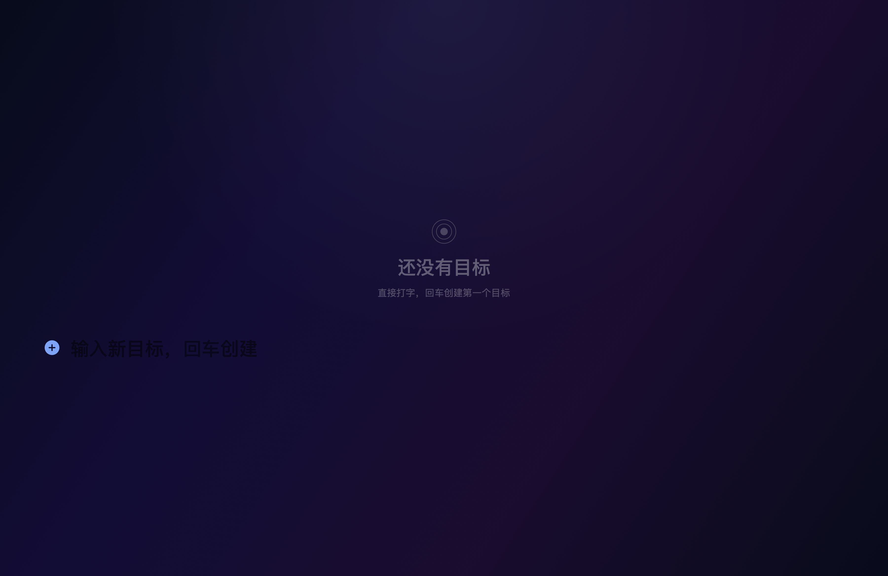

# Kairos（时机）

按 **⌘⇧S** 呼出的极简全屏目标管理：**打字即新建、回车即创建、点方块即完成**。
全屏大字、只有目标本身，没有多余 UI；常驻后台、无 Dock 图标、零权限热键。


中英双语，配置面板一键切换。

> 演示：`demo/kairos-demo.mp4` · `demo/kairos-2.jpg`

## 特性

- **全屏大字**（56pt 目标文字），纯淡入淡出动效，深靛蓝极光背景 + 7s 整屏呼吸
- **首启引导**：第一次启动自动呼出并展示快捷键卡片（一生一次；用你自定义后的实际键名。
  看过即永不再弹——没有任何常驻提示，别人路过看不到这是个热键 App）
- **扁平目标列表**：打字 + Tab 无关、一层到底，没有层级心智负担
- **画布分组**（默认 Personal / Work），←/→ 环形切换，背景色相跟随
- **倒计时 + 强制签到**：到点应用自己弹出来逼你处理——专为 ADHD 场景设计
- **签到反馈 + 历史面板**：反馈随目标永久存档，随时回看
- **动态背景**单开关：极光流动 + 呼吸一体开关，关掉 CPU 归零

## 安装与构建

### 前提

- **macOS 15+**（`MeshGradient` 等 API）
- 默认热键 **⌘⇧S**（Command+Shift+S，极少被其他 App 占用；不是 F 键，无需任何键盘设置）。
  想要别的键：设置 → **热键** → 点「录制…」按一下新键（功能键或带修饰键的组合；
  普通字符键会吃字被拒绝）。如果用 F 键，需要在 系统设置 → 键盘 开启「将 F1、F2 等键
  用作标准功能键」，否则 F 键是媒体键（F10=静音），设置面板会红字提示

### 构建

```bash
swift build -c release        # SwiftPM，无需 Xcode
./Packaging/package.sh        # → dist/Kairos.app（ad-hoc 签名）
open dist/Kairos.app
```

### 安装（GitHub Release）

1. 从 [Releases](https://github.com/lodrg/kairos/releases) 下载 `Kairos.dmg`（或 `Kairos.app.zip`）
2. 双击 DMG → 把 Kairos 拖进 Applications（ZIP 则解压后拖）
3. 首次打开：**右键 → 打开**（ad-hoc 签名未公证，macOS 会拦一下；之后正常双击即可）
4. 若提示"无法验证开发者"：终端执行 `xattr -dr com.apple.quarantine /Applications/Kairos.app` 一次

### 自启与退出

- 开机自启：系统设置 → 通用 → 登录项 → 添加 `dist/Kairos.app`
- 退出：菜单栏图标 → Quit（无 Dock 图标）

## 使用

### 键位总表

| 操作 | 效果 |
|---|---|
| **呼出键**（默认 ⌘⇧S，可录制） | 隐藏时按一下呼出全屏覆盖层（0.34s 淡入）；可见时再按一下收起（呼出后 0.45s 内的再次按下会被当作双击忽略，双击不会闪没） |
| **Esc** | 收起（0.26s 渐隐），切回之前正在做的事；编辑/选中等多层状态按 Esc 逐级退回 |

**热键只有一个：呼出键，开关式（隐藏按一下呼出、可见按一下收起）；Esc 永远兜底收起**
（设置 → 热键可录制呼出键）。注意：如果用 F 键而系统把它们当媒体键（设置里会红字
提示），录裸 F 键不会生效——按提示开启「将 F1、F2 等键用作标准功能键」，或录带修饰键
的组合。
| 打字 + 回车 | 新建目标 |
| **⌘+V 粘贴** | 多行文本（输入框空）→ **每行一条批量创建**；单行 → 直接粘进输入栏 |
| 打字 + **⌘+回车** | 新建目标并**直接按「默认时长」开始计时**（跳过选择） |
| 输入框空 + 选中目标 + 回车 | 勾掉选中目标（淡出，淡出中再按可撤销） |
| 勾掉目标后 | 选中光标自动挤到**上一条**目标 |
| 点击方块 / 目标文字 | 勾选完成 / 行内编辑（⌘+回车 = 换行，支持多行；短文本回车保存） |
| **编辑中清空文本 + 退格** | 删除该目标（带淡出；淡出中点击该行或 Esc 可反悔） |
| **编辑中清空文本 + 回车** | 同样删除（两条路一样） |
| **⌘+Backspace**（输入框空 + 选中目标） | 删除选中目标（带淡出；淡出中点击或 Esc 可反悔） |
| Esc | 一级退出选中态；二级取消编辑；三级收起 |
| **← / →** | 切换画布（输入框空且未编辑时才生效，否则移动光标） |
| **↑ / ↓** | 移动选中目标 |
| **⌘T** | 展开时长选择（给选中目标 / 下一条新目标计时） |
| **⌘.** | 呼出/收起配置面板（菜单栏 → Settings… 也行） |
| 菜单栏图标 | Show / Hide、Settings…、Quit |

### 目标管理

- **新建**：直接打字 + 回车，出现在列表最下方（紧贴输入栏）。输入栏是单行——超长
  不会丢字（字段内滚动）；想写多行/长内容就先建一个短标题，再点进去多行编辑。
  **复制一段多行清单（比如别的笔记 App 里的待办）直接 ⌘+V 粘贴** = 每行一条自动创建
- **完成**：点方块，或选中后按回车——整行淡出 0.55s 退场（记录永久保留）
- **批量完成**：勾掉后光标自动落在上一条，连续回车一路勾下去
- **编辑**：点目标文字行内编辑——短文本回车保存；**长文本/多行自动切多行编辑器**，
  回车 = 保存、**⌘+回车 = 换行**、Esc = 取消。长目标在列表里最多显示两行
  （自动缩字号），完整内容点进去就能看到
- **删除**：编辑中清空文本后按**退格**或**回车**；或选中目标后 **⌘+Backspace**——
  都走同一条淡出退场；**淡出中点击该行 / 按 Esc 收起可反悔**

### 画布

目标按画布分组，←/→ 环形切换：目标区交叉淡入淡出、背景色相跟随、顶部短暂显示画布名。
新增 / 改名 / 删除 / 换色在配置面板里。

### 倒计时 + 强制签到

给目标挂倒计时，**到点应用自己弹出来**，逼你处理——不是提醒，是打断。
拖延往往不是不想做，而是「过一会儿再看」的那个「过一会儿」永远不来。

- **计时**：⌘T 展开预设（默认 3/5/15/30/60，可编辑），←/→ 选、回车确认；
  或者打字 + **⌘+Enter** 直接用默认时长一步到位；「新目标自动开始计时」开关可全自动
- **到期**：后台每 5s 轮询（比墙钟，不是 per-goal 系统定时器——Mac 睡眠后照样判对）。
  自动呼出覆盖层、切到对应画布；同时到期几条一次只处理一条
- **计时光带（非唤起态）**：**覆盖层收起、有计时在跑时**，屏幕底部（Dock 上方）一条
  细光带随剩余时间从满到空（剩最后 10% 变橙色）——你在别的 App 干活时也能感觉到
  时间在流动；纯装饰、点击穿透、不抢焦点。唤起覆盖层后光带消失（列表里有时钟徽章）；
  设置里可关
- **签到卡片**：目标 + **多行反馈输入框**（自动聚焦，回车换行）。就两个键：

| 键 | 效果 |
|---|---|
| **回车** | 保存反馈 + 结束目标（输入法组合态下回车先上屏拼音） |
| **⌘+回车** | 换行（写多行反馈） |
| **Esc** | 继续——按原时长重启计时，并弹**全屏重选时长**（默认当前时长，回车按同样时长继续；←/→ 选、回车确认；再按 Esc 或点外面取消） |

- **反馈**：随目标永久保存在 goals.json 的 `feedback` 字段；Esc 继续时草稿保留
- **历史**：配置面板 → 历史，查看所有已完成目标与反馈（直接读 goals.json，不另存）；
  每条显示**开始 → 结束时间**（计时目标取首次武装时间，未计时取创建时间）
- **退路**：签到未决时呼出键/菜单栏收起被锁定（强制本身）；Esc（继续）和 Quit 永远可用。
  签到卡片只有两个出口：回车 = 结束、Esc = 继续

### 配置面板（⌘.）

- **倒计时签到**：预设时长（可编辑）、默认时长（常用预设点选 + 自定义输入）、
  新目标自动开始计时、创建后保持计时
- **Canvases**：增删改画布、色相选择（最后一块不能删）
- **Background**（背景独立一张卡）：动态背景开关 + **色相（0–360°）/ 饱和度（0–200%）/
  明度（0–200%）三个滑杆**——HSV 三项全可调，在调色板源头生效（色相/饱和度/明度是
  颜色本身的属性，不是整体加白加黑），不影响布局/动效/画布逻辑；画布色相跟随单独叠加
- **Appearance & Layout**：透明模式（AI 协作——覆盖层人可见、AI 截图/点击/键盘全穿透、
  签到暂停）；输入栏位置、文字大小两个步进器
- **Hotkeys**：呼出键一个（点「录制…」按新键；F 键或有修饰键的组合；普通字符键会跟输入
  冲突被拒绝；**被其他 App 占用时红字提示换键**）。收起永远是 Esc，不可配置
- **Layout**：输入栏位置（35%–75%，默认 0.618 黄金分割位）、文字大小（整体缩放系数）；
  行高/字高、输入栏高/行高、呼出/收起动画时长比都按黄金比 φ 派生，基线固定不随内容漂移
- **Language**：English / 中文 即时切换（全部文案单一来源 `L10n.swift`）
- **History**：曾经的目标与反馈
- **Help**：重播首次引导（点一下立刻看快捷键卡，只这一次，之后不会再自动弹）
- **Check for updates**：检查更新——对比 GitHub 最新 Release，有新版点击直达下载页
  （轻量档；以后有 Apple Developer 账号换 Sparkle 自动更新）

配置改动即时生效，无需重启。面板高度自适应屏幕：小屏/低分辨率下整体变成可滚动的
卡片，不会再顶破屏幕。

## 数据存储

| 内容 | 位置 |
|---|---|
| 目标（含完成状态、计时器、**反馈**） | `~/Library/Application Support/Kairos/goals.json` |
| 配置（时长、语言、外观、布局） | `~/Library/Application Support/Kairos/settings.json` |
| v1 迁移备份（老数据） | `~/Library/Application Support/Kairos/goals.v1.json` |

（改名链 F8Goals → Mirrage → **Kairos**：首次启动时旧目录自动整体搬过来，
一次性，无需手动处理。）

勾选完成的目标永远留在 goals.json 留档，不删除。文件不存在/损坏静默退回默认值。

## 已知限制

**微信键盘焦点**：签到卡片弹出时如果前台正好是微信（WeChat），macOS 26 会拒绝后台
App 抢键盘焦点（新旧激活 API 都试过，系统级限制），打字会落进微信。
**点一下卡片即获得焦点**，之后输入正常；其他 App 前台时无此问题。

## 开发

### 项目结构

```
Sources/Kairos/
├── App/                      # 生命周期与系统接线
│   ├── main.swift            # 入口（@main）
│   ├── AppDelegate.swift     # 窗口/动画/本地按键监听/到期扫描
│   └── HotkeyManager.swift   # Carbon 全局热键（呼出键 + 冲突检测，零权限）
├── Models/                   # 数据与配置
│   ├── Models.swift          # Goal/Canvas/GoalTimer + GoalStore（goals.json）
│   ├── Settings.swift        # Settings + SettingsStore（settings.json）
│   └── L10n.swift            # 全部文案的唯一来源（en/zh）
└── Views/
    ├── OverlayView.swift     # 主视图：布局/键盘/签到/重选时长（849 行，按 MARK 分区）
    ├── GoalRow.swift         # 目标行 / 倒计时徽章 / 勾选方块
    ├── CheckInView.swift     # 签到卡片（输入框 + 两个键）
    ├── SettingsPanel.swift   # ⌘. 配置面板
    ├── HistoryPanel.swift    # 历史子面板
    ├── AuroraBackground.swift# 极光网格 + 呼吸层
    └── Theme.swift           # Motion（动效参数）/ Palette / Metrics
```

### 调试入口

```bash
dist/Kairos.app/Contents/MacOS/Kairos --show          # 启动后自动呼出
... --hide                                              # 启动后保持收起
... --show-settings                                     # 直接摆出配置面板
... --show-arming                                       # 直接摆出时长选择
... --show-retime <目标ID>                              # 直接摆出全屏重选时长
```

### 技术要点

- **零权限热键**：Carbon `RegisterEventHotKey`，无需辅助功能/输入监控权限
- **覆盖层**：无边框 `.screenSaver` 层级窗口、跨 Space、多屏每屏一块；不打断底层 App
- **按键分工**：Esc/⌘./⌘+Enter/⌘+Backspace/退格删编辑目标/签到键走 AppDelegate 的
  `NSEvent` 本地监听（`onKeyPress` 收不到 ⌘ 组合键）；方向键走 SwiftUI `onKeyPress`
  条件拦截，靠返回 `.ignored` 放行给输入框
- **不测量布局**：行高是常量、区域高度累加计算，不用 GeometryReader
  （量高再回填 @State 会形成「内容高度→布局→内容高度」的抖动回路）
- **到期轮询比墙钟**：5s 一次，不挂 per-goal 系统定时器，跨睡眠判断正确
- **动效单一来源**：所有曲线时长集中在 `Theme.swift` 的 `Motion`

完整工程决策记录见 **[docs/DESIGN.md](docs/DESIGN.md)**（布局与动效、逐条设计要点）。
